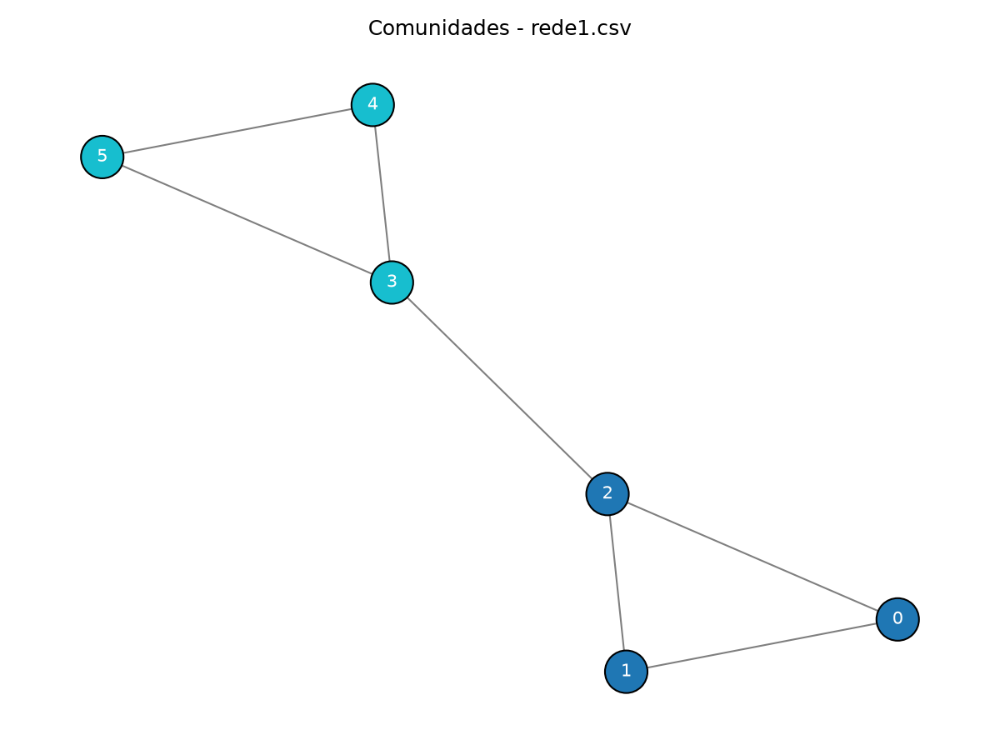
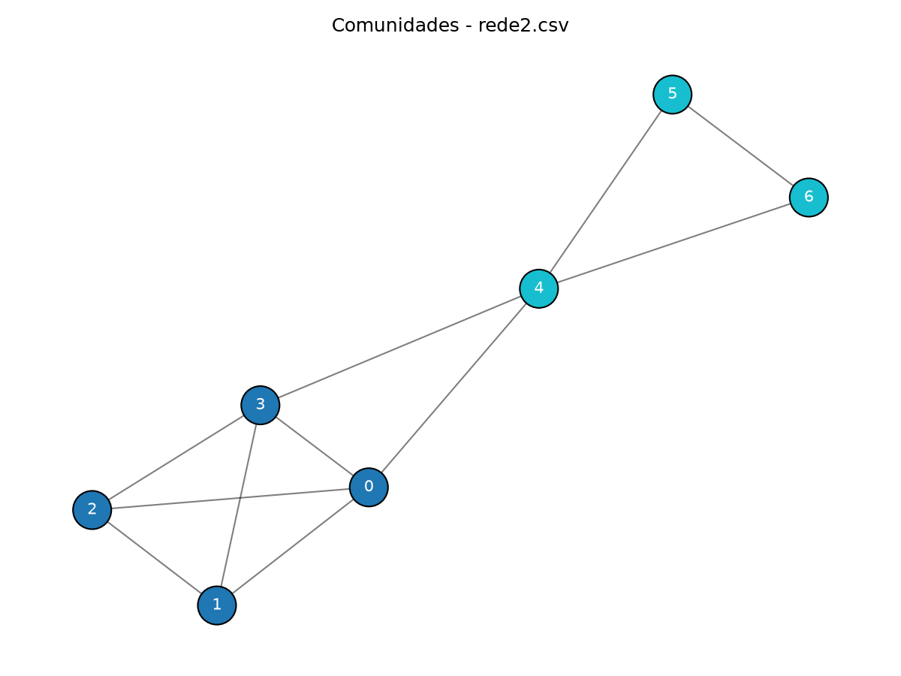

# Detecção de Comunidades em Redes

## 1. Descrição
Este projeto implementa o algoritmo Label Propagation para detecção de comunidades em grafos não direcionados e não ponderados.

O algoritmo recebe uma rede via arquivo CSV contendo as arestas do grafo, identifica as labels dos vértices, as remapeia e associa a inteiros contíguos de 0 a N. Em seguida, a partir de ordens distintas de visitação, percorre o grafo modificando (ou não) a label de cada vértice para a moda das labels de seus vizinhos. Ao final, os vértices com mesma label são considerados de uma mesma comunidade.

## 2. Requisitos

- Python 3.14.7
- Conda
- NetworkX
- NumPy

## 3. Instruções de Configuração

Clone o repositório:
git clone https://github.com/Tiago19M/Algoritmo_Deteccao_Redes

Vá para o diretório:
cd Algoritmo_Deteccao_Redes

Configure o ambiente Conda:
Criação: conda env create -f environment.yml
Ativação: conda activate deteccao-redes

## 4. Execução

Com o ambiente Conda ativado e já no diretório do projeto, execute:
python deteccaoRedes.py

## 5. Arquivos de entrada

Os arquivos de entrada devem ser fornecidos em formato CSV contendo todas as arestas do grafo. Cada linha deve possuir dois identificadores separados por vírgula:

```text
origem,destino
```

## 6. Resultados dos testes

### Dataset rede1.csv
- Máximo de iterações: 100
- Número de vértices: 6
- Número de arestas: 7
- Número de comunidades encontradas: 2

* Comunidades encontradas:
- Comunidade de label 0: vértice 0, vértice 1, vértice 2
- Comunidade de label 5: vértice 3, vértice 4, vértice 5



### Dataset rede2.csv
- Máximo de iterações: 100
- Número de vértices: 7
- Número de arestas: 11
- Número de comunidades encontradas: 2

* Comunidades encontradas:
- Comunidade de label 1: vértice 0, vértice 1, vértice 2, vértice 3
- Comunidade de label 5: vértice 4, vértice 5, vértice 6



Obs: como o algoritmo utiliza de aleatoriedade para a determinação da ordem de visitação dos vértices e também para a escolha da label em caso de empate de frequências, diferentes execuções podem gerar diferentes resultados.

## 8. Dificuldades encontradas

### Remapeamento dos vértices
Uma das maiores dificuldades encontradas foi tratar a possibilidade de arquivos com identificadores de vértices não sequenciais, que poderia quebrar a estrutura utilizada se nada fosse feito. Como solução, foi implementada uma lógica de remapeamento onde cada label original seria associada a uma nova label num intervalo favorável e sequencial [0, n] e vice-versa.

### Dificuldades técnicas
Outra questão que dificultou o desenvolvimento foi a falta de domínio e experiência com as ferramentas utilizadas (Python, NetworkX, NumPy), que nos levou muitas vezes a tomar decisões não tão práticas.